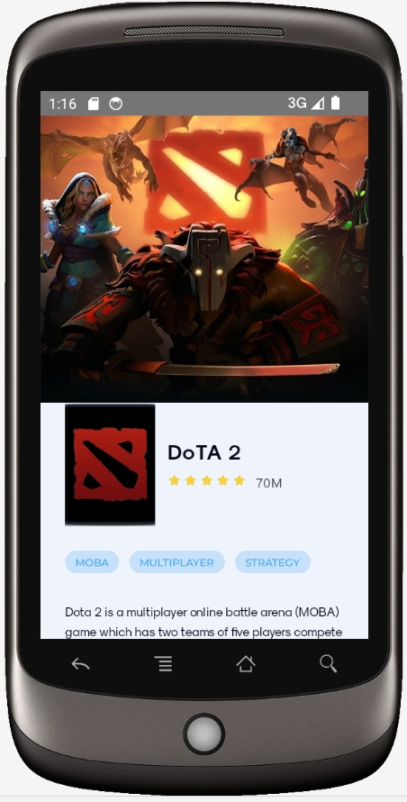
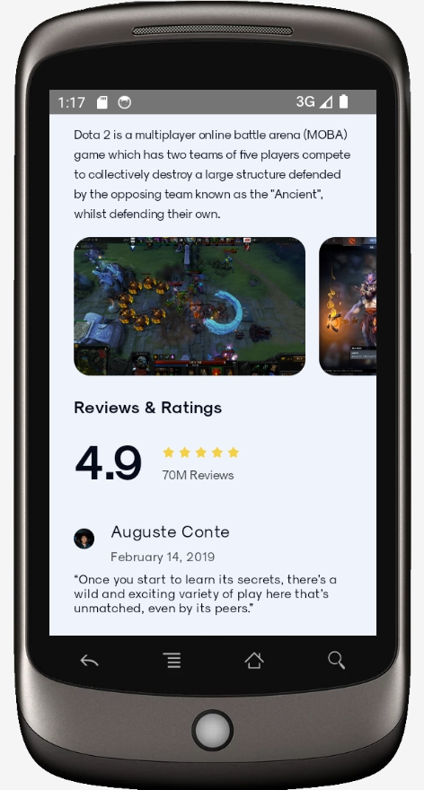

# Лабораторная работа 1 по Android

<u>*Задание*</u>: разработать Android приложение по следующему [макету](https://www.figma.com/file/8AeQGXA4dwLaboZzj4EQ7D/Android?type=design&node-id=0:1&mode=dev). 

В ходе разработки был использован фреймворк Jetpack Compose.

Чтобы запустить проект, необходимо клонировать репозиторий командой ниже

```git
git clone https://github.com/juliazubova/effective_android.git effective_android  --branch develop
```

<u>*Результат*</u>: 

Для устройства Samsung Galaxy A51, API 33

|Темная тема|Светлая тема|
|:-:|:-:|
|||

Для устройства Nexus One, API 34


||||
|:-:|:-:|:-:|